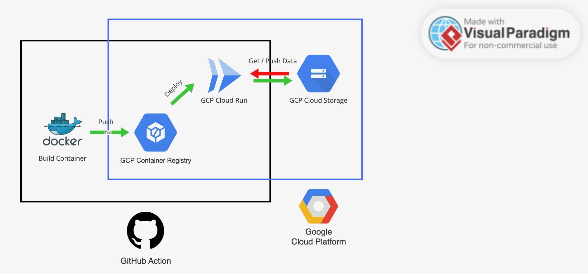

# Justin 麵屋雞金集點統計 bot (Justin Ramen Point Calculation Bot)

賈斯丁寶寶（@JustinLin099）要在三週內在麵屋雞金集 300 點換只有他有的獎品 (顯卡)
為了達成目標他會請大家吃便宜拉麵  
每吃一碗拉麵可以拿到一點，晚上 10 點之後去吃可以一次拿兩點  
拿 1 點跟賈斯丁寶寶可以換 50 元，等於夜間吃到半價的拉麵

Justin（@JustinLin099） needs to collect 300 points in 3 weeks to exchange presents. (Graphic card)  
He is going to provide cheaper price ramen for people who help him to collect points.  
You can get a 1 point when you order any kind of ramen, and you can get twice when you go to ramen shop after 10 p.m.  
You can redeem 1 point to 50 NT dollars, which means you can get a 1/2 discount price to purchase ramen at night.

Justin achieve his goal in [16 days](https://ramen.justinlin.tw).  

## Diagram



- Build container and push to GitHub Package.
- Push container to GCP Container Registry.
- Deploy to Cloud Run.
- Fetch db content from GCP Cloud storage.

## Quickstart

- Ramen first!

https://t.me/+hqwgjycUkN04OGI1

- Create db.json and .env file

```sh
mkdir data
touch data/db.json
echo CHANNEL_TOKEN=<Your Channel Token> > .env
```

- Start server

```sh
# node
node index.js

# docker
docker run --name justin-ramen-bot --env-file .env -d -v $PWD/data:/app/data ghcr.io/liaojason2/justin-ramen-bot:latest
```

## Feature

- Add / remove poll (**Telegram has bug in chinese characters**).
- Automatic Pin / unpin poll.
- Check current point status.
- Ramen point and redeem rule.

## Special Thanks

- [Contributors](https://github.com/liaojason2/justin-ramen-telegram-bot/graphs/contributors)
- Sugar daddy @justinlin099

## Reference

- [Using Cloud Storage FUSE with Cloud Run tutorial](https://cloud.google.com/run/docs/tutorials/network-filesystems-fuse)
- Data source [Justin-Ramen](https://github.com/gnehs/Justin-Ramen)
